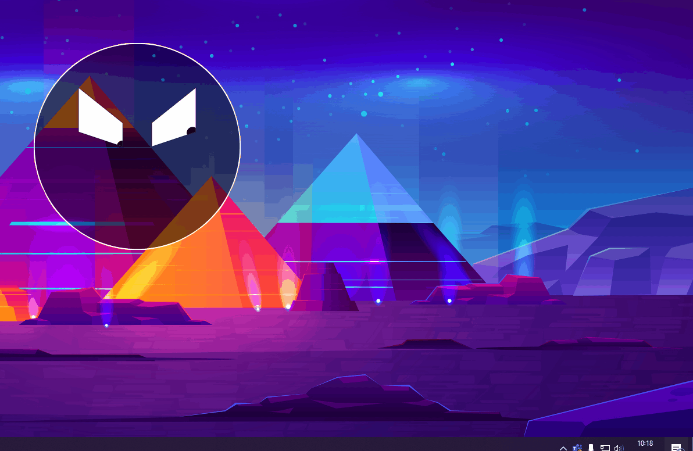

# Smart-Card-Removal-Reminder
This application runs in the background and reminds you with nice animations to remove your smart card from your smart card reader. You can also choose between preset snooze times at which you want to be reminded.

The program works only under Windows and the smart card reader function must be enabled.

## Preview

